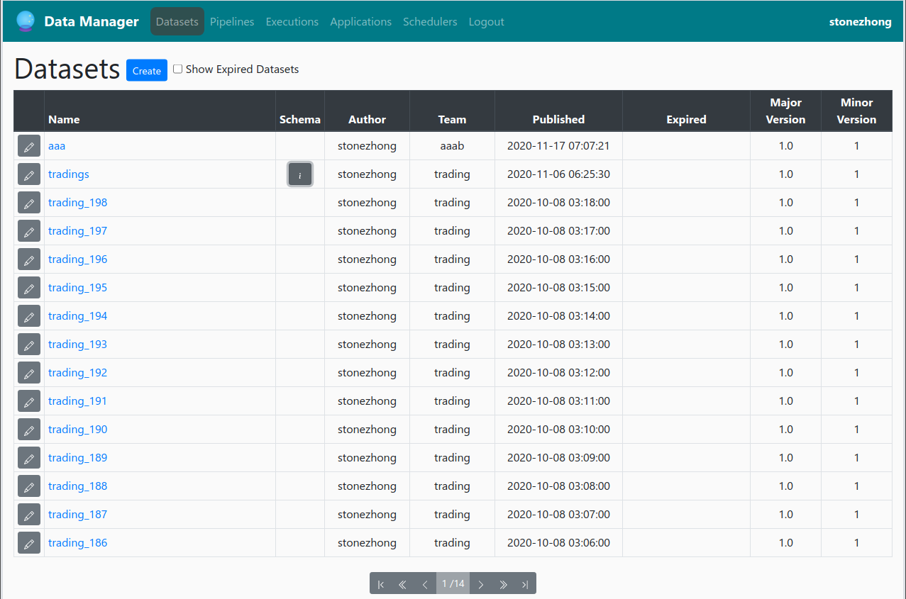
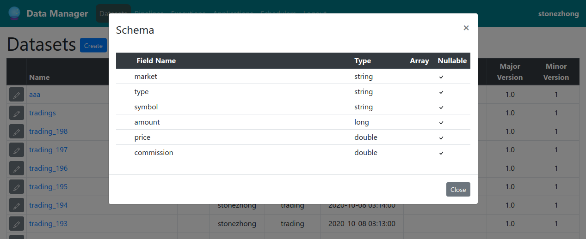
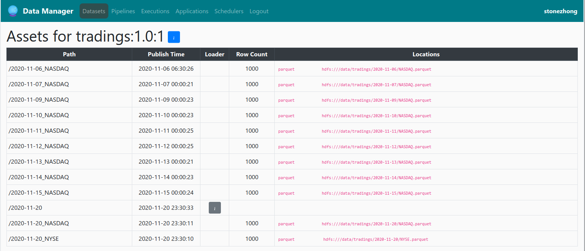
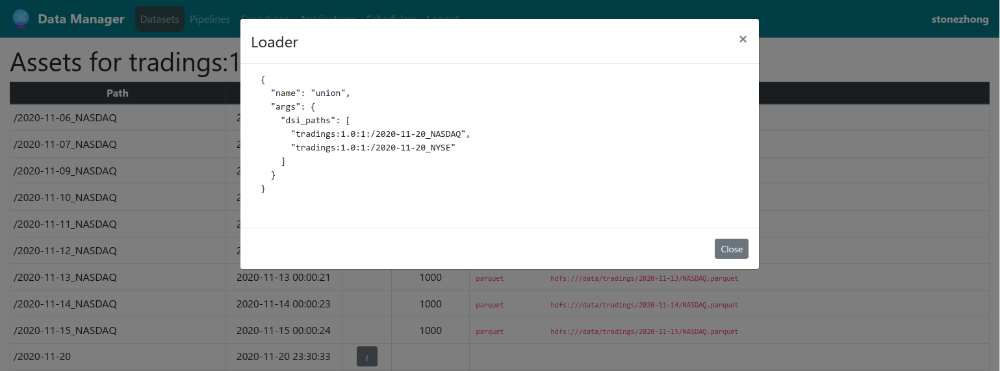

# Data Manager for Data Lake

Manages data assets and ETL pipelines for Apache Spark based Data Lake.

## Here is a list of platform we supports:
<table>
    <tr>
        <td>
            
        </td>
        <td>You setup your own Apache Spark Cluster.</td>
    </tr>
    <tr>
        <td>
            
        </td>
        <td>
            Use <a href="https://pypi.org/project/pyspark/">PySpark</a> package, fully compatible to other spark platform, allows you to test your pipeline in a single computer.
        </td>
    </tr>
    <tr>
        <td>
            
        </td>
        <td>You host your spark cluster in <a href="https://databricks.com/">databricks</a></td>
    </tr>
    <tr>
        <td>
            
        </td>
        <td>You host your spark cluster in <a href="https://aws.amazon.com/emr/">Amazon AWS EMR</a></td>
    </tr>
    <tr>
        <td>
            
        </td>
        <td>You host your spark cluster in <a href="https://cloud.google.com/dataproc">Google Cloud</a></td>
    </tr>
    <tr>
        <td>
            
        </td>
        <td>You host your spark cluster in <a href="https://azure.microsoft.com/en-us/services/hdinsight/">Microsoft Azure HDInsight</a></td>
    </tr>
    <tr>
        <td>
            
        </td>
        <td>
            You host your spark cluster in <a href="https://www.oracle.com/big-data/data-flow/">Oracle Cloud Infrastructure, Data Flow Service</a>
        </td>
    </tr>
    <tr>
        <td>
            
        </td>
        <td>You host your spark cluster in <a href="https://www.ibm.com/products/big-data-and-analytics">IBM Cloud</a></td>
    </tr>
</table>

# Data Manager Feature

* [Data Catalog](#Data-Catalog)
* [Asset Tracking and data linage](#Asset-Tracking-and-data-linage)
* [Uniformed Spark Job Layer](#Uniformed-Spark-Job-Layer)
* [UI for Building ETL Pipeline](#UI-for-Building-ETL-Pipeline)

## Data Catalog

Keep track all datasets

* List all datasets
* Choose a dataset, you can view the schema of it.

Screenshot for list datasets:

Screenshot for show schema of a dataset:

## Asset Tracking

List all assets

Data Manage can show you all the asset of a dataset.

Support for views

"asset" can be materized file, such as parquet, json or csv file, "asset" can also be a "view", which through a "loader", you can get the dataframe as well.
In this example, the asset <code>tradings:1.0:1:/2020-11-20</code> is a view, it unions 2 other assets

## Uniformed Spark Job Layer

dm-job-lib

Through [dm-job-lib](client/dm-job-lib), user's application can load asset, write asset, and register asset.

* Application using dm-job-lib to load, write assets are decoupled from specific cloud provider and can migrate to other platform easily.
* Application using dm-job-lib can be tested using PySPark with small scale of data easily.

uniformed tool to build, deploy and run job for all platforms

Please checkout [data-appls]

## UI for Building ETL Pipeline
Pleaee see the youtube video for details.

